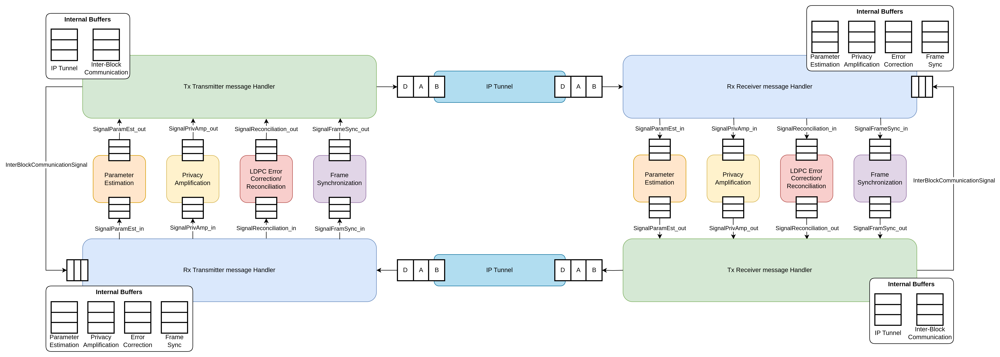

# System End-To-End complete test

This test is a end-to-end test, meant to represent a full system. This system is represented by the following image:

Dummy data will be produced by the Core Blocks (Center blocks) and sent to the Message Handler's that will distribute it. 

# Header and Source files

To execute this test, the Source and Header files used from outside this projects were:
* `message_handler.h`, located on the `include` folder in the main folder of the repository
* `message_handler.cpp`, located on the `lib` folder in the main folder of the repository
* `netxpto_20200819.h`, located on the `include` folder in the main folder of the repository
* `netxpto_20200819.cpp`, located on the `lib` folder in the main folder of the repository

# Construction of the System

The Message Handler was built with modularity in sight, so the tests should also take advantage and build upon that basis. 

We started by dividing the system into two main Blocks or **SuperBlocks** and connected them using two signals, representing the IP Tunnel (the IP Tunnel was the only element of the architecture not used in this system). This allowed us to have a level of abstraction, enabling us, in the main test file `test_complete_system.cpp` to declare, initialize and run the test with few lines of code and configurations.

## Dummy Block

The Dummy Block is the representation of a Core Block (i.e., Parameter Estimation, Privacy Amplification, etc.). This  Dummy Block takes advantage of the class Block defined in the `netxpto_20200819.h` file, mimicking even more a real system. 

A Block is composed of mainly a *initialize*, *runBlock* and *terminate* functions that dictate the lifecycle of the Block. Next is a brief explanation of each one of this functions:
* **Initialize**: As the name suggests, it's used to initialize or perform a operation on the first execution of a Block. In this test, no operation is required.
* **runBlock**: The Blocks functions as a Synchronous, single-thread module that offers a degree of abstraction, behaving as if they were a separate process. This means that once they are declared and execution is initiated, they aren't meant to execute for a prolonged time, instead they are supposed to execute and perform some operations and then hand control to the other Blocks. The Dummy Blocks use this function to process messages in the Input Signal and generate messages to be placed in the Output Signals.
* **terminate**: This function is made to signal the termination of the Block. This gives the ability for the Block to perform programmed tasks, such as destroying resources or save it's state. In this case, this function is used to evaluate if there were any lost messages that were sent or messages that were or were waiting to be processed at the time of termination.

In order for the Dummy Block to be generic and represent the various needed Core Blocks, when instantiating it, a name can be given. This way, it's a lot easier to assess the correct delivery of messages.

### Execution in runBlock

The Dummy Blocks has an internal list, provided by the SuperBlock, that contains the possible blocks to send information. It randomly elects a destination Block, placing that information in header the data field (Each generated message has an ID that is then saved to assert if the message got lost). The receiving block will check the destination Block on the header and the data field, assessing if he's the intended receiver of the message. If he is, a message will be produced and sent as a response. If not, a message will be printed in the screen indicating that the message was received by mistake.

## SuperBlock

The SuperBlock is defined in the `netxpto_20200819.h` as a Block that is composed of a combination of Blocks. Taking advantage of this definition, we defined two SuperBlocks:
* **Left SuperBlock**: Defined in the `left_superblock.h` file, this Block is composed of all the modules in the left side of the image and handles the execution between them. It also connects to it's Input and Output signals, to be able to communicate with the other SuperBlock. The Blocks managed by this SuperBlock are the following (declared from Top-To-Bottom, like in the image):
    * Tx Transmitter Message Handler Right - Receives messages from Dummy Blocks and relays them according to the Destination Block
    * Parameter Estimation Left - Dummy Block that processes and generates messages
    * Privacy Amplification Left - Dummy Block that processes and generates messages
    * Error Correction Left - Dummy Block that processes and generates messages
    * Frame Synchronization Left - Dummy Block that processes and generates messages
    * Rx Transmitter Message Handler Left -  Receives messages from the Output Signals and transmits them to the Dummy Blocks

* **Right SuperBlock**: Defined in the `right_superblock.h` file, this Block is composed of all the modules in the right side of the image and handles the execution between them. It also connects to it's Input and Output signals, to be able to communicate with the other SuperBlock.
    * Rx Transmitter Message Handler Right - Receives messages from the Output Signals and transmits them to the Dummy Blocks
    * Parameter Estimation Right - Dummy Block that processes and generates messages
    * Privacy Amplification Right - Dummy Block that processes and generates messages
    * Error Correction Right - Dummy Block that processes and generates messages
    * Frame Synchronization Right - Dummy Block that processes and generates messages
    * Tx Transmitter Message Handler Right -  Receives messages from the Dummy Blocks and relays them according to the Destination Block

### Execution in runBlock

Each execution signalled, the SuperBlock will grant execution time to each Block and set the number of messages that each Dummy Block should generate. 

### Termination by SuperBlock

The SuperBlock has two ways to stop the execution:
1. Stop the execution abruptly by executing the *terminate* function, checking if any message was lost.
2. Graceful stop, where the *sendSignalToTerminate* is used to stop the Dummy Blocks from generating new messages but still being able to process and respond to messages. Then the *terminate* function is also used to fully stop the simulation and assess the system state.
    * To ensure a proper termination, the *sendSignalToTerminate* function can be activated to the remaining 5-10% of iterations, making so that unprocessed messages are less likely to exist.

# Run this test

In order to run this test, please head over to the main project folder and follow the Compilation and Execution instructions.

# Disclaimer

Some aspects aren't tested by this test, mainly the Order of Insertion and Retrieval of the Priority Buffers in the Message Handler's, since that wouldn't allow proper randomness of the data. Instead we rely on the unit tests of that class to ensure proper execution.